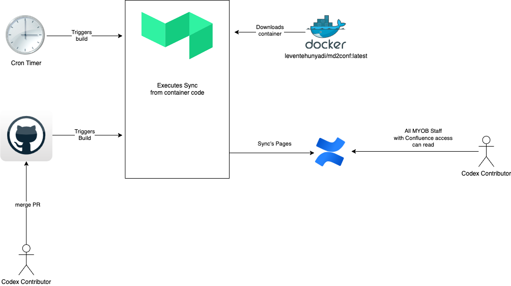

# MYOB Codex

[](https://buildkite.com/myob/myob-codex)

This is the repository for [the MYOB Codex, rendered on Confluence](https://myobconfluence.atlassian.net/wiki/spaces/TEC/pages/8855027852/MYOB+Codex).

## Sync to Confluence

Content is written in Markdown and published to Confluence using [md2conf](https://github.com/hunyadi/md2conf).

All `.md` files in the `content` directory are synced to Confluence.

### Creating a Confluence page

Create a page in the [MYOB Codex](https://myobconfluence.atlassian.net/l/cp/zcTkXtk8) section of the Technology Confluence space.

Choose a page title, move it to the appropriate section, and publish the page.

Create a `.md` file in the `content` directory. Each `.md` file must include the following metadata, where `ID` is the Confluence page ID for the page the content should be synced to. For example, the page ID for <https://myobconfluence.atlassian.net/wiki/spaces/TEC/pages/8855027852/MYOB+Codex> is `8855027852`.

```markdown
<!-- confluence-page-id: ID -->
```

### Triggering a sync

If you are working from a branch, a draft copy of the Codex content will be synced to a separate [Codex Confluence space](https://myobconfluence.atlassian.net/wiki/spaces/CODEX/overview) intended for the working group.

Once your changes are merged into the `main` branch, [the pipeline](https://buildkite.com/myob/myob-codex/builds?branch=main) will attempt to sync to the [Technology Confluence space](https://myobconfluence.atlassian.net/wiki/spaces/TEC/overview?homepageId=1375145290) intended for consumers of the Codex.

## Release

The Codex is continuously updated and synced to Confluence. However, releases are used made to mark and announce changes.

To release a new version of the Codex:

1. Update the `[Unreleased]` tag in [changelog file](./content/CHANGELOG.md) to the release number, for example `2023.07.30`
2. Commit and merge this change to main
3. Publish a [new GitHub release](https://github.com/MYOB-Technology/codex/releases/new)
4. Publicise on ALL THE CHANNELS!

## Threat Model

This system is a git repo that syncs to Confluence.

We are bound by the permissions attached to GitHub repo, Confluence, and Buildkite.



We use wiz-cli to scan the md2conf image as there is a risk it may contain malicious code. 
