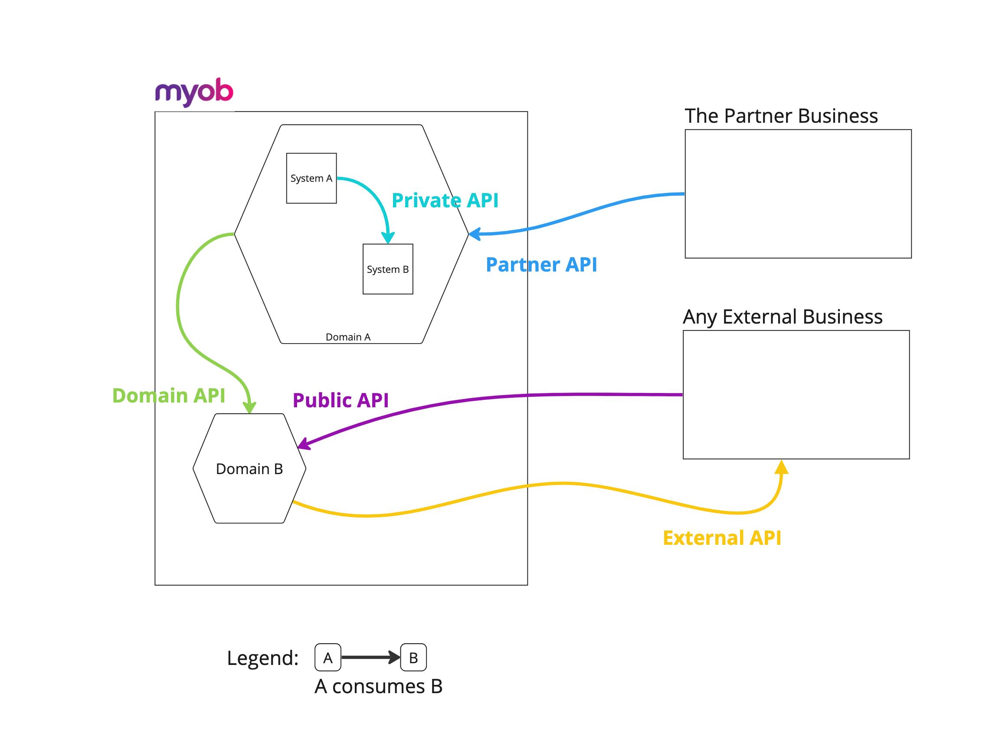

<!-- confluence-page-id: 9422700933 -->

# Types of APIs

Different types of APIs have different requirements depending on their Domain and scope. These requirements vary slightly depending on how widespread the impact of an API change or outage can be.

This section define important types of API for MYOB teams to use as a reference.

These API types are defined by the intended consumers of the API - e.g. internal, external. This is a separate concern from whether the API is internet-facing, although this might be more likely for external consumers such as partners and developers.

## Types of API that are deployed by MYOB teams

| Type | Description | Requirements | Examples |
|------|-------------|--------------|----------|
| *Public/Open APIs* | Public APIs are available to be consumed by external businesses, including developers of 3rd party applications. | We always expect a deeper level of authentication and authorisation based on having less control over the API client. The documentation will be published publicly, and interested developers can register to access the public APIs. Changes to the Public APIs must be done carefully to avoid breaking changes for a wide number of unknown consumers. | <ul><li>[MYOB Business API](https://developer.myob.com/api/myob-business-api/)</li><li>[MYOB Advanced API](https://developer.myob.com/api/advanced/)</li></ul> |
| *Partner APIs* | Partner APIs are available to be consumed by specific external businesses through a private agreement between MYOB and that business. Often only accessed by authorised developers. | These APIs are not documented publicly. Access control is set up specifically for each partner. Changes to partner APIs can be negotiated and coordinated directly with the partners. | <ul><li>Bank Feeds APIs for bank institutions to load bank data</li><li>BATO Digital Services Gateway</li><li>ATO DSG</li><li>Government APIs Support Queries</li></ul> |
| *Domain/Internal APIs* | Domain APIs are only available to MYOB systems, and are primarily designed to provide data access and services to other MYOB teams. | Domain APIs should be well documented and changed with care as Domain APIs may be used widely within MYOB. If an API is not "Domain Bound" then all efforts should be made to make it a Domain API rather than going directly to a service. | <ul><li>SME Platform API</li></ul> |
| *Private/Internal APIs* | Private APIs are not to be used by any other domains at MYOB and the team will have the full control over the change management. | Documentation is still important within the domain, but APIs don't have to be documented for a wide audience. Private APIs can be changed quickly without widespread impacts. | <ul><li>A web UI BFF for a MYOB product</li><li>An admin API for an internal system</li></ul> |

## Types of external API that we use of outside of MYOB

| Type | Description | Examples |
|------|-------------|----------|
| *External APIs* | External APIs are the APIs external to MYOB that we consume. These might be free or a paid subscription, and could be publicly or privately available APIs. | <ul><li>AWS APIs</li><li>Snowflake APIs</li><li>Address lookup services</li><li>NZ/ATO Tax Lodgement APIs</li><li>NZBN/ABN lookup service</li></ul> |
| *Composite APIs* | External APIs, which combine multiple APIs, and could be publicly or privately available APIs. | <ul><li>…</li></ul> |

### There are also three common types of API architectures

- REST, a collection of guidelines for lightweight, scalable web APIs.
- SOAP, a stricter protocol for more secure APIs.
- RPC, a protocol for invoking processes that can be written with XML (XML-RPC) or JSON (JSON-RPC).

## Further info or feedback

Please email us at <codex@myob.com> or contact us on Slack: [#sig-tech-codex](https://myob.slack.com/archives/C02N8ADPGUX)
