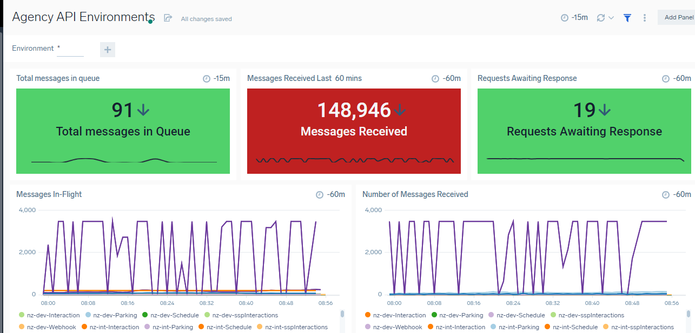
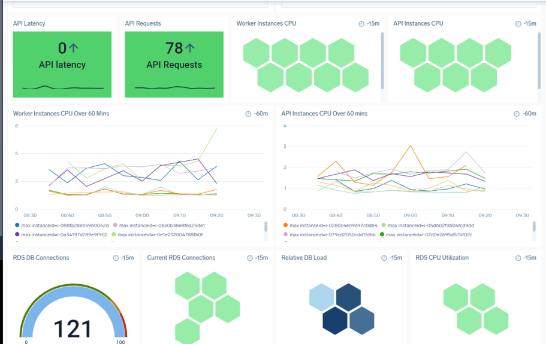
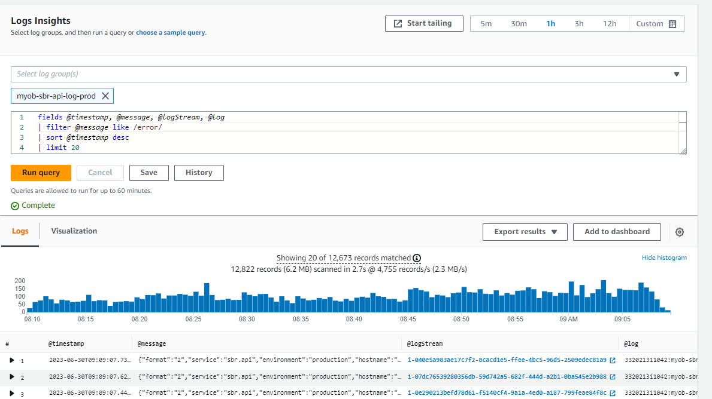
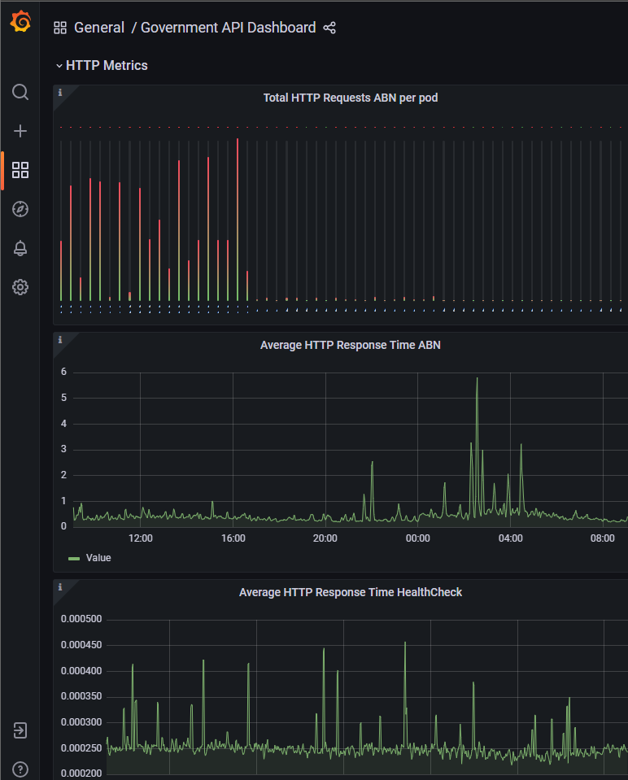
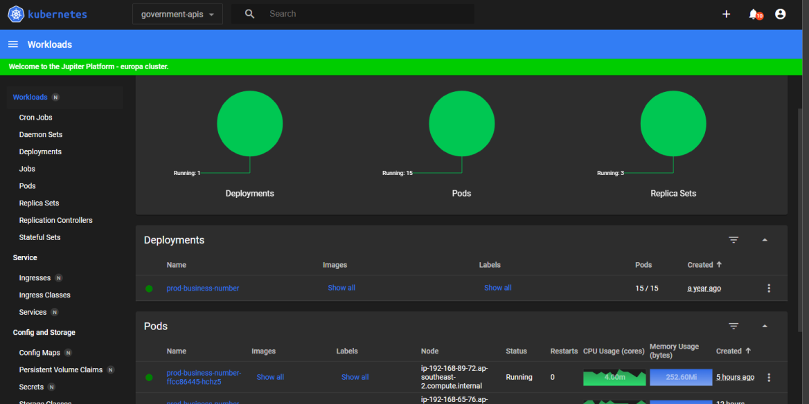
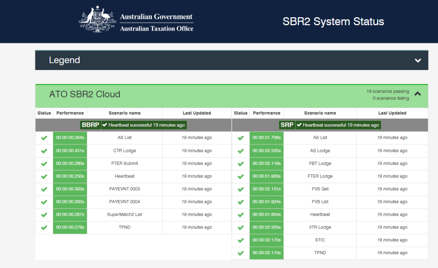

<!-- confluence-page-id: 9312829451 -->

# API Observability Examples

## Observable Environments
Here are some examples of environments being observed with dashboards and other display types.
### Sumo Logic

[Agency API Environments](https://service.au.sumologic.com/ui/#/dashboardv2/vPsTdcKGf4Kdm52USlCxpQ4iS4fMIAcxeGfMbkTFgh5G8vqlyvmxTqd543Bd)

### CloudWatch
CloudWatch is an example of queryable logs. Whilst this can be fed to dashboards as metrics (e.g. Sumo queries to find number of occurrences of categories like WebHookProcessorPerformance etc..) The data within can also define the causes of metrics in a dashboards panel.

**Example of a simple Government API Log Query**

### Grafana

[Government API Dashboard](https://dashboard.svc.europa.jupiter.myob.com/#/workloads?namespace=government-apis)

### Kubernetes

[Government API Kubernetes Dashboard](https://monitoring.gapi.svc.europa.jupiter.myob.com/d/knnSZB3nk/government-api-dashboard)

### ATO System Dashboard (Bluemix)

[SBR 2 Bluemix- Overall and Detail view](https://sbr2.status.ato.gov.au/)

---

## Further info or feedback
Please email us at codex@myob.com or contact us on slack: [#sig-tech-codex](https://myob.slack.com/archives/C02N8ADPGUX)
