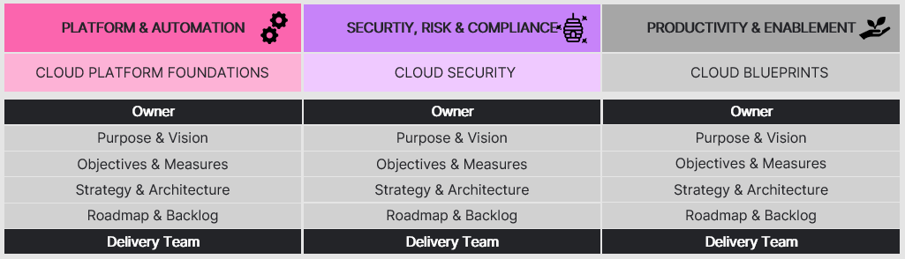

---

<!-- confluence-page-id: 9426534456 -->

# Cloud Operating Model

---

## What is a Cloud Operating Model?

A successful cloud operating model (COM) enables organisations to operate applications reliably and securely in the cloud with a faster pace of innovation and value to the business. A key component of leading COM approaches is the adoption of a Product based approach of the cloud platform. By adopting a product mindset, each team can take the responsibility and accountability for increased awareness, ownership and operational excellence through self-healing systems that can recover quickly using integrated failure detection and remediation

MYOB’s cloud operating model is made up of 12 capabilities.

## Platform & Automation

Capabilities in this portfolio focus on developing strong cloud platform foundations and automation capabilities to enable rapid, scalable cloud adoption.

## Security, Risk & Compliance

Capabilities in this portfolio focus on building a safe, sound and secure cloud computing environment so that the MYOB business can run and operate production workloads in public cloud.

## Productivity & Enablement

Capabilities in this portfolio work towards enabling and educating MYOB’s cloud development community, while providing tools and technologies to make the workforce more productive in cloud.

# Capabilities allow us to think holistically but deliver incrementally

We define maturity targets we aim to reach over the long-term that are based on technology, security and business direction. Not all capabilities need to be addressed equally. We prioritise based on the immediate needs of our customers (the business).

## Why are cloud capabilities important?

It is difficult to reason about, solve and plan for the delivery of a large monolithic platform. A decomposition into outcome-based initiatives (cloud capabilities) with well-defined bounded contexts simplifies problem articulation, solutioning, prioritisation, planning, and execution.

This decomposition also acts as an effective scaling mechanism and an acceleration function for rapid value delivery; MYOB can deliver as much as the team allows with concurrent and independent streams of execution. Each team can optimise their own delivery cadence.

## Each cloud capability is loosely coupled, independent and backed by a single-threaded owner and cross-functional delivery team

