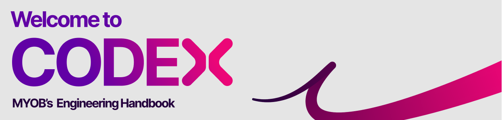

<!-- confluence-page-id: 8855027852 -->

# MYOB Technology Codex

MYOB teams share common foundations so that we can plan, design, develop, deploy, and operate our systems effectively. The Codex outlines how we do engineering and architecture across MYOB. It describes our widely used practices and processes, as well as the principles and philosophies we use to guide delivery of our products.

It is both a guide for new team members to understand how we do things, as well as an ongoing reference for existing team members.

!!! info "How do I use the Codex?"
    There are many ways you should use the Codex.
    Please read [*About the MYOB Technology Codex*](./about/README.md) for some suggestions.

# Chapters and Contents

| Chapter | Description |
| ------- | ----------- |
| [About the Codex](./about/README.md) | What is the Codex, and how do I use it? |
| [Delivering Software](./deliver/README.md) | How we continuously deliver high quality software. |
| [Building Security In](./security/README.md) | How we ensure our software is secure and compliant. |
| [Engineering Standards](./engineering-standards/README.md) | What are the standards that you are required to know about and implement. |
| [Process and Governance](./process-and-governance/README.md) | How we approach process and governance at MYOB |
| [Data](./data/README.md) | How we approach building data products at MYOB |
| [APIs](./apis-and-integration/APIs.md) | How we approach building robust APIs and integrating with other systems|

# Codex

**For** MYOB Teams (and also partners, and broader MYOB)

**Who** are designing, building, maintaining and supporting MYOB systems (need to make engineering choices)

**The** MYOB Engineering Codex

**Is a** maintained library of just enough architectural and engineering guidance

**That** empowers teams to make faster informed decisions (enables MYOB to integrate with partners safely and at speed)

**Unlike** the current mix of unmaintained Confluence pages and GitHub repos

**Our product** is easy to discover, easy to trust and easy to contribute

### Levels of guidance

Codex has 3 levels of guidance for chapters and practices.

- **Suggestion**: This is a recommendation that we suggest you do, but you do not HAVE to do it if you think it wouldn't work for your team or specific use case.
- **Default**: This is a practice you must be doing unless you have a good reason or explanation to not be doing it. Defaults are well-researched, applied, and tested, so they are good sensible practices to be used by default.
- **Standard**: This is a practice you must be doing, always. Either due to internal policy or to meet legislative or industry standards.

# Further info or feedback

Please email us at <codex@myob.com> or contact us on slack: [#sig-tech-codex](https://myob.slack.com/archives/C02N8ADPGUX)
