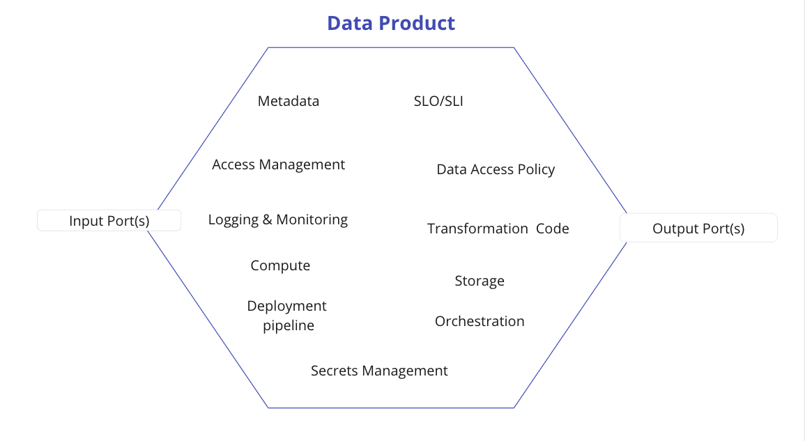
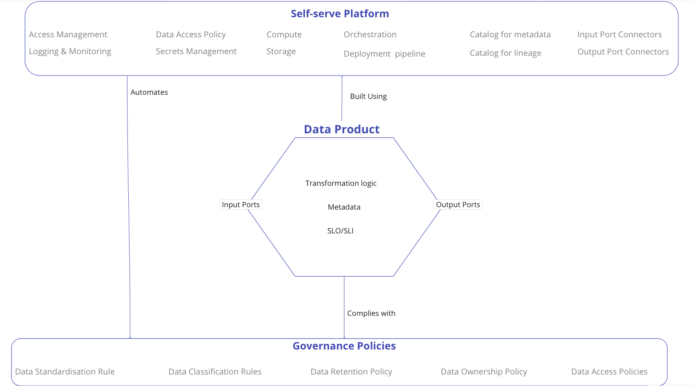

<!-- confluence-page-id: 9293923320 -->

# What is a Data Product?

## Data product != datasets

A data product is a service or product centred on data, harnessing the **power of analytics** to provide users with value. This value can manifest in various ways, including enhanced decision-making, deeper insights into customer behaviour, or heightened operational efficiency.

**For consumer**: Data Product provides value and can be consumed with trust in a preferred/agreeable format.

**For producer**: Data Product is a service that is designed to meet the needs of the end user and that the data producer is committed to maintaining.

**For developer** : A data product is composition of code, data and infrastructure i.e a self-contained unit that is packaged and delivered to solve a specific problem.

* Code:
  * To consume, transform and serve data.
  * To provide access to data, semantic and syntax schema, observability metrics and other metadata.
  * To enforce governance e.g.: access control policies, compliance, provenance, etc.
* Data and Metadata:
  * Analytical data in the expected format.
  * Metadata in its intrinsic and extrinsic form.
* Infrastructure:
  * To build, deploy and run the data product's code, as well as storage and access to data and metadata.

# Why do we need Data Products?

To realise the strategic potential of data, establishing trust in data is essential through the adoption of a product-oriented mindset. At present, the centralised approach to analytical usage is demonstrating limited scalability. Additionally, the disconnect between analytical data and domain-specific expertise and ownership is impeding efficiency, leading to issues like diminished data trust, terminology confusion, and challenges related to data discovery and security.

Applying a product-oriented approach to data involves treating data supplied by different domains as a product and the consumers of that data as satisfied customers. This is precisely why we need data products at MYOB.

# Data Product Characteristics

A data product must meet the following criteria to be called a data product.

| Characteristic | Checklist Question | Value Unlocked |
| -------------- | ------------------ | -------------- |
| Discoverable | Can users at MYOB independently find your data product and view all the relevant metadata?| <ul><li>Greater usage and value.</li><li>Reduced cost of experimentation.</li></ul> |
| Addressable | Does it have a permanent and unique address so that the users can access it programmatically or manually without significant friction or a lengthy process? | <ul><li> Greater usage and value.</li></ul> |
| Understandable | Is there a formal representation of semantics and schemas available for the users to understand and use the data? | <ul><li> Faster decision making.</li><li>Greater usage and value.</li><li>Reduced cost of experimentation.</li></ul> |
| Trustable | Can it be trusted with quality and integrity per the expectations so that Data products can be consistently and reliably combined together, follow standardisation and harmonisation rules? | <ul><li>Reduced cost of experimentation.</li><li>Confident decision making.</li></ul> |
| Natively accessible | Can data users access it with their native tools without significant friction or a lengthy process? | <ul><li>Greater usage and value.</li><li>Reduced cost of experimentation.</li></ul> |
| Valuable on its own | Does it have an output that is valuable and meaningful on its own without being joined and correlated with other data products so that teams spend time focusing on the most valuable use case and avoid the anti-pattern of mapping every interim dataset as a data product? | <ul><li> Focus on value and impact.</li></ul> |
| Interoperable | Does it clearly define standardised features to facilitate joining and interaction with other data products? E.g.: schemas, support for data linking, shared metadata structures, and stable structures that allow backwards compatibility. | <ul><li>Faster decision making.</li><li>Greater usage and value.</li></ul> |
| Secure | Can it be securely stored and consumed? Can access be granted by data product/domain owners so that Data product teams can consume the data products from other teams with confidence and without significant friction or a lengthy process? | <ul><li>Greater usage and value.</li><li>Reduced cost of experimentation.</li><li>Faster decision making.</li></ul> |

# Data Product basic building blocks

Data Product encapsulates all necessary components needed to implement its usability characteristics and behaviours of securely sharing analytical data. It holds the domain oriented data and code that performs the necessary data transformations and shares the data and the policies governing the data. The below visual shows examples of building blocks of a data product.

The data platform team provides a variety of services that enable data producers, consumers, and governance teams to focus on their core competencies and expertise, rather than having to worry about the underlying data infrastructure and tooling. The below data product blueprint provides a visual representation of the different services that the data platform team offers and also shows how these services are interconnected.

## Further info or feedback

* Check out [this article](https://martinfowler.com/articles/data-mesh-principles.html) for a deep dive on data product.
* To learn how to identify data products for a use case, click [here](./identifying-data-products.md).
* To understand how to design a data product, click [here](./designing-data-product.md).

Please email us at <codex@myob.com> or contact us on slack: [#sig-tech-codex](https://myob.slack.com/archives/C02N8ADPGUX)
