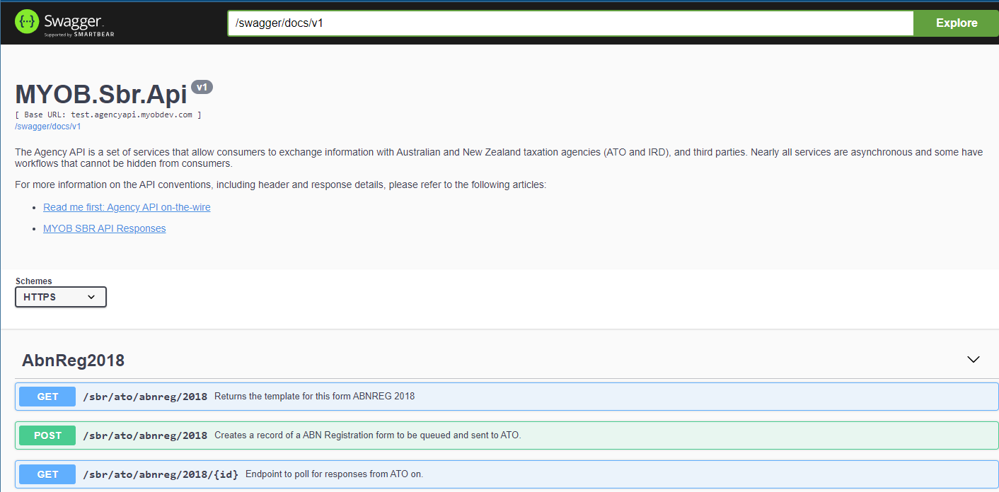
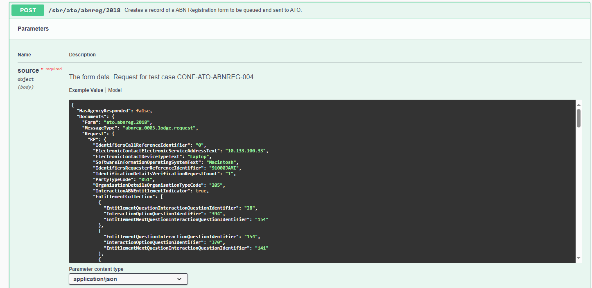
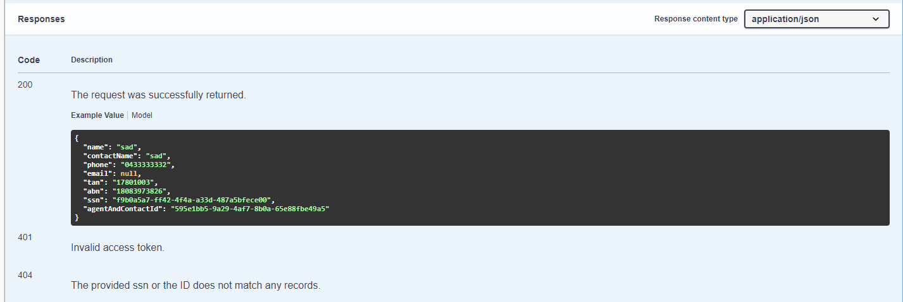
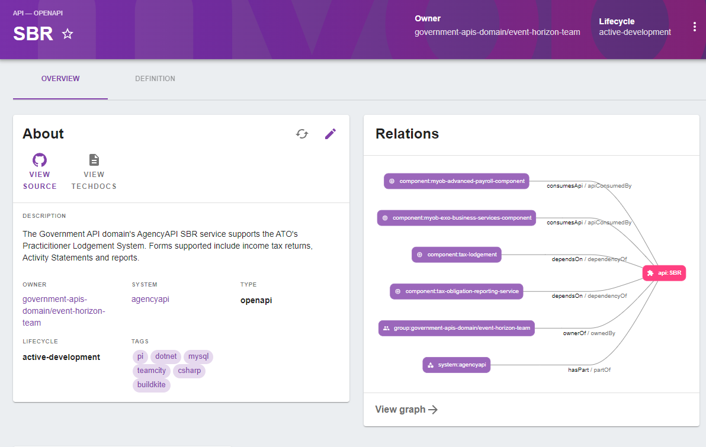
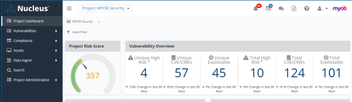
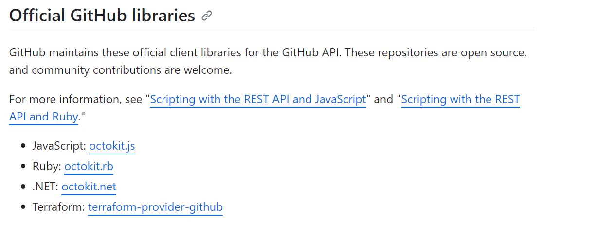
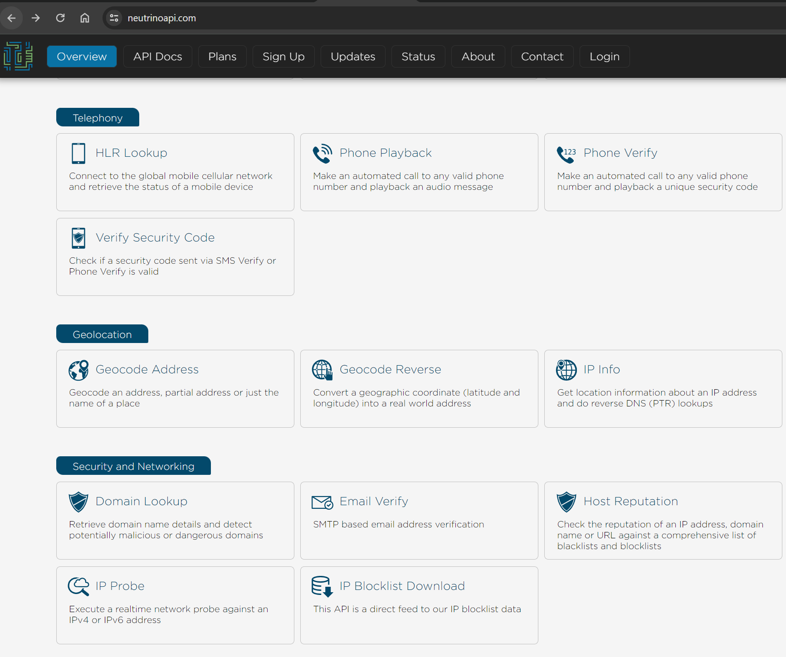
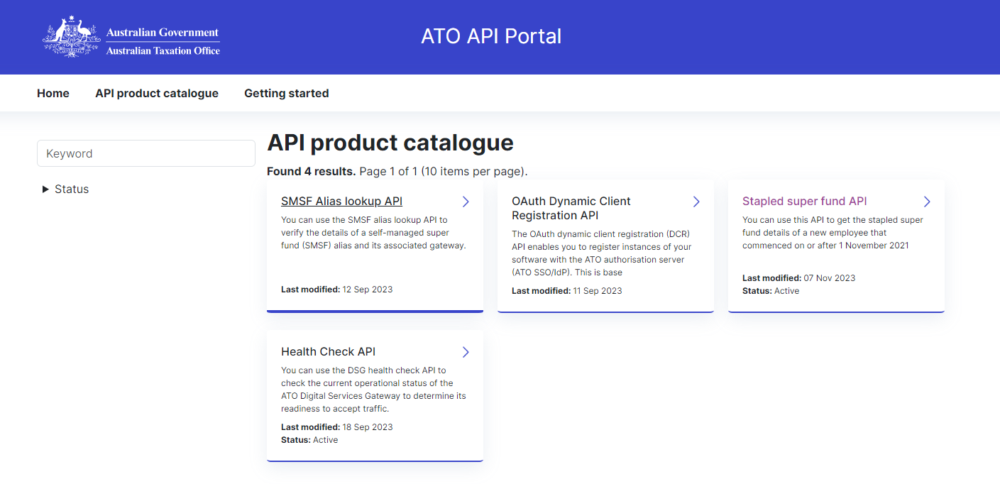
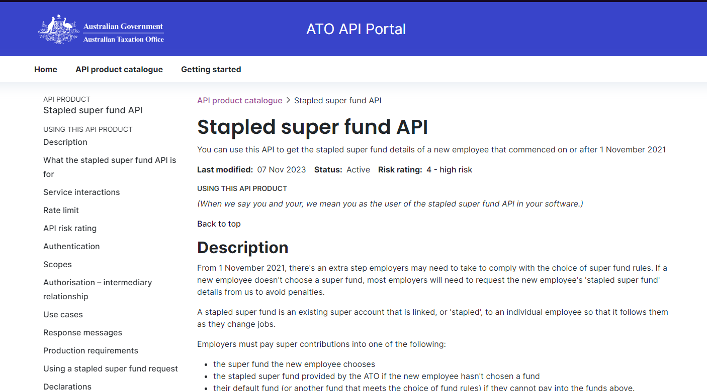

<!-- confluence-page-id: 9293661652 -->

# API Discoverability Examples

## Swagger
**Government API Swagger**

[Swagger](https://swagger.io/tools/swaggerhub/) is an API definition and documentation Hub that allows the endpoints in an API to be individually documented. The documentation here can give examples of Requests and expected responses along with descriptions and rules for using a particular endpoint.

Documenting the usage of an API and its endpoints (essentially functions) in this manner allows consumers of the endpoints to use them in the manner that they were meant to be used. This essentially holds developer documentation for an API.

Discovery in Swagger not allows consumers of an API to work with individual endpoints but it also allows consumers to explore the other features of an API. Thus possibly implementing new features that were previously unknown to them.

**Examples**

-
[Swagger SBR Example](https://test.agencyapi.myobdev.com/swagger/ui/index#)

---

### Swagger Code Examples

Below is an example of a code snippet that can be used to access the SBR API. In this case it is an example of the information and format of a Request for the Registration of an ABN with the ATO (Australian Tax Office)

Response examples are also available so a consumer can see the response format (JSON in this case) and sample data to expect during response processing.

---

## System Catalogue

The [MYOB System Catalogue](https://system-catalogue.myob.com/) is a good example of a Portal. The System Catalogue aggregates information about MYOB's APIs and systems fro m multiple sources including GitHub and Buildkite. Catalogue information includes system owner, type of system, and relationships to consumers. API links to Swagger are also available here.

[SBR System Cat Entry](https://system-catalogue.myob.com/catalog/default/api/SBR)

---

## Nucleus

Nucleus is not a traditional API portal as such but it still aids in the Discovery of APIs. Nucleus focuses on Risk and Vulnerabilities of APIs as well as serving as a system dashboard. Nucleus in included here as an example of an alternative type of discovery. If discovery is really the gleaning of information needed to use an API then Nucleus provides information about the long term health and status of the API.

[Nucleus Landing Page](https://nucleus-aus2.nucleussec.com/nucleus/public/app/index.php?sso=b3JnX2lkJTNEMTQwMDAwMDAlMjZkb21haW4lM0RteW9iLmNvbQ==#bc/15000001/cHJvamVjdC5Qcm9qZWN0)

---

## Code Snippets

Following is an example of GitHub's SDK in various programming languages.

[GitHub SDK](https://docs.github.com/en/rest/overview/libraries-for-the-rest-api?apiVersion=2022-11-28)

---

## Categories
Following is an example of one of the company using grouping in their API's into different categories.

[Neutrino API](https://www.neutrinoapi.com/)
---
## External Discovery Example

# ATO API Portal

An external example of an API Portal is exemplified by the ATO's API Portal. Here the API offerings are displayed easily and can be searched by keywords. Further documentation is available when drilling down into the API itself.
- [API Portal](https://apiportal.ato.gov.au/)

- [Stapled Superfund API](https://apiportal.ato.gov.au/api-products/stapled-super-fund-api)

---
# External Discovery Examples
Here are some further examples of discoverable environments.
- [JSON APIs](http://apisjson.org/)
- [Postman API Discovery](https://www.postman.com/explore)
- [Aid to Discovery](https://swagger.io/)
- [GitHub API Docs](https://docs.github.com/en/rest?apiVersion=2022-11-28)
- [RapidAPI](https://rapidapi.com/)
- [Google APIs Explorer](https://developers.google.com/apis-explorer)
- [GitHub - A collective list of free APIs for use in software and web development](https://github.com/public-apis/public-apis)

---

# Resources & Useful Links
- [Discovery Definition](https://rapidapi.com/blog/api-glossary/api-discovery/)
 - [Swagger](https://swagger.io/tools/swaggerhub/)

## Further info or feedback
Please email us at codex@myob.com or contact us on slack: [#sig-tech-codex](https://myob.slack.com/archives/C02N8ADPGUX)

---

