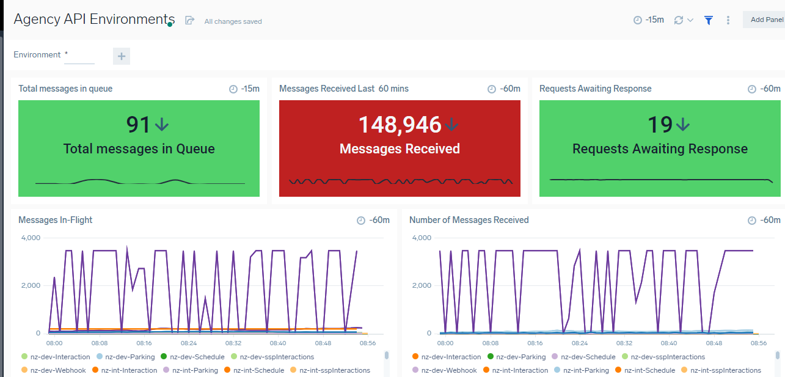
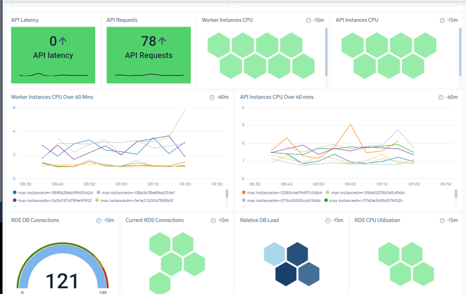
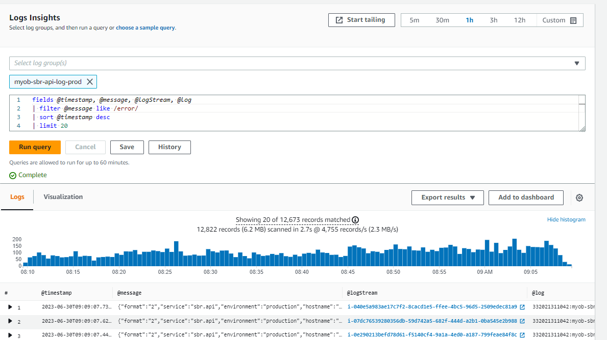
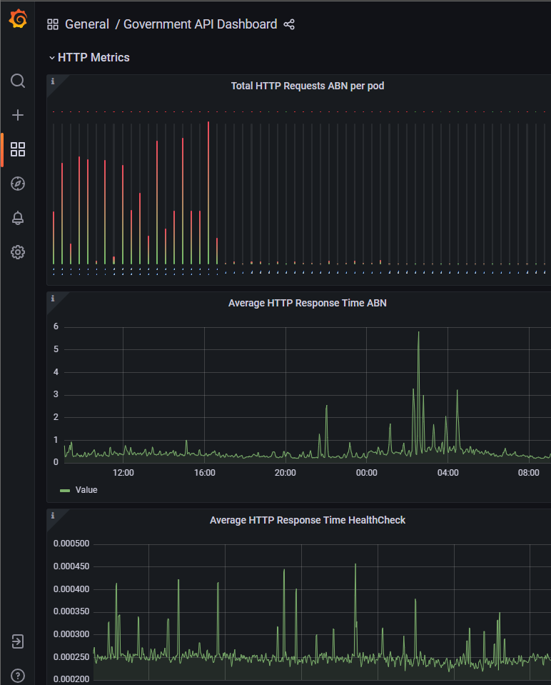
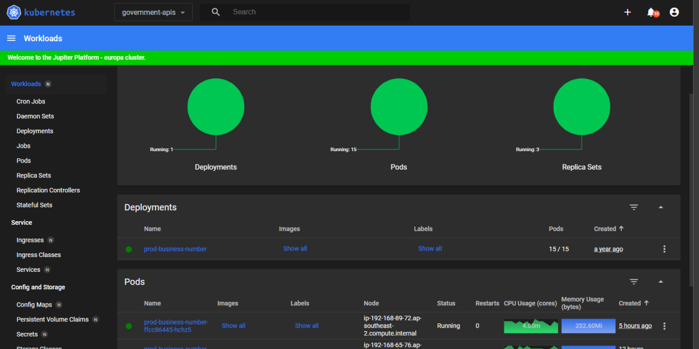
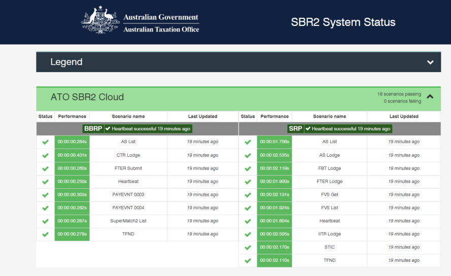

---

<!-- confluence-page-id: 9312600069 -->

# API Observability

---

## Intro

API Observability is essentially the monitoring of the health of APIs in a system. Generally speaking to monitor APIs, a number of metrics must be gathered together in a statistical Report or publicly (within company or team) viewable Dashboard.
Currently the preferred method of observing APIs is the dashboard. Dashboards allow the main areas of health to be monitored easily and an API's health can be seen "at a glance." The Observability team has created a standard called the [Observability Low Bar](https://myobconfluence.atlassian.net/wiki/spaces/OBSERVE/pages/8999962595/Observability+Low+Bar) which outlines the recommendations for **minimum viable observability** in an API. Ultimately teams should aim for the ability to know what your system is doing without making a code change. Whilst this is somewhat of a "Holy Grail" it is a good goal to aim for in all API operations.

Some advantages of Dashboards are, they;

- Can measure metrics that matter.

- Track progress and change in data.

- Analyse data to support data-led decisions.

- Highlight areas of potential growth and areas of weakness.

- Provide data for establishing alerting thresholds.

- Brings all API health monitoring into a central location.

Another method of observing API health is Alerting. This can also be presented in a Dashboard or as messages sent via text, slack, email etc.

Dashboards often bring together what is known as the [Golden Pillars of Observability](https://devops.com/metrics-logs-and-traces-the-golden-triangle-of-observability-in-monitoring/). These are;

- Metrics - Health and performance information.

- Logs - Point to the reasons for failure.

- and Traces - Information about specific application operations.

Whilst dashboards usually display Metrics and give minute to minute analysis of system health. They can be setup to monitor Logs and Traces for errors or specific events.

For further information and in depth guidance, check the Observability teams [ObsCentral](https://myobconfluence.atlassian.net/wiki/spaces/OBSERVE/pages/2576254898/Obs+Central) notes for a good place to start. Also the Observability Teams [Homepage](https://myobconfluence.atlassian.net/wiki/spaces/OBSERVE/overview?homepageId=917012582) holds many ideas and good advice.

## Dashboards

Dashboards often fall into one of three categories or types;

- **Operational dashboards** – these dashboards help the user see API state now (or at least in the last 15 minutes)

- **Analytical dashboards** – these dashboards give the user a clear view of performance trends and potential problems in a system.

- **Strategic dashboards** – this type of dashboard lets Teams track higher level goals e.g. OKRs.

Most Teams will use the Operational and Analytical type of dashboards. Strategic dashboards are used more for Team leads and Managers wanting an over all view of how systems are tracking against standards etc.

There are a few guidelines for designing Metric dashboards. Generally the goals should be;

- Clear visualisation of data.

- Easy filtering and refining of the data set (for most useful views)

- The use of standard views for displaying metrics.

- Be clear about what you're trying to achieve – your board’s purpose will inform its design.

- Only include what's relevant to the board's purpose - Anything that is only supportive or peripherally important can go on another board.

- Miller’s Law - The average person can only keep 7 (plus or minus 2) items in their working memory - remember this for panels/metrics.

- Use views or filters over the same data to keep the information specific and not overwhelming.

- Use the most efficient visualisation for a given metric (more about this in Visualising Metrics).

- Group related metrics.

- Use size and position to show importance. i.e. Large metrics or elements indicate importance, Panels that are displayed first are the used most.

- Reduce visual noise. E.g. If you can show only a line on a graph, essential labels (minimal data on axes) and maybe data when "hovering over" this allows the view to remain uncluttered and metrics and trends to be seen clearly.

### Visualising Metrics

When visualising metrics it is always important to choose the visualisation that most clearly communicates the data. To this end certain visualisations are better for certain types of data.
Some uses for data visualisations are shown below;

- **Line Chart**: Used to show trends over time or sequential data.
  - It is ideal for visualising data over a time period.

- **Bar Chart**: Suitable for comparing categories or discrete data points.
  - Bar charts are effective for comparing data by category, e.g. HTTP Errors per Application stack.

- **Pie Chart**: Useful for illustrating proportions or percentages of a whole.
  - Pie charts are commonly used to represent ratios, e.g. percentages of error types on an application stack.

- **Scatter Plot**: Helps visualise the relationship between two variables.
  - It is valuable for displaying correlations, identifying clusters, or detecting outliers in data points.

- **Histogram**: Displays the distribution of numerical data.
  - Histograms are beneficial for understanding data frequency.

- **Heatmap**: Shows data density and patterns in a two-dimensional grid.
  - Heatmaps are often used for visualising website traffic.

- **Gantt Chart**: Utilised for project management and scheduling.
  - Gantt charts illustrate tasks, their start and end dates, and dependencies, making it easy to track progress and timelines.

- **Tree Map**: Ideal for hierarchical or nested data.
  - Tree maps can represent file sizes on a disk, or the organisation of a directory structure.

- **Network Graph**: Displays relationships between entities.
  - Network graphs are useful for visualising infrastructure connections.

- **Choropleth Map**: Presents data using color-coded regions (e.g., countries, states).
  - Choropleth maps are commonly used to represent demographic data or geographic statistics.

- **Bullet Graph**: Bullet graphs are great for tracking progress towards goals or targets.
  - They can display actual versus target values for key performance indicators (or OKRs).

- **Gauge Chart**: Gauge charts are effective for displaying single-value metrics in relation to a predefined range or threshold.

## What Data to observe

Modern systems generate a lot of data and not all the data is equal. Therefore, an in-depth system audit is important to establish the critical data that would require immediate attention before they cause system-wide impacts.

Following are the benefits of observing critical data :-

- Easier to identify and address issues in important area leading to lower downtime.

- Cost effectiveness - By focusing on critical data, the resources can be focused on important areas thus leading to cost effectiveness.

- Less clutter - By observing only critical data we can avoid cluttering with excess data.

## Alerts

It is important to have correct alerts as part of observability. Not all error needs alerts. Alerts should be configured to send notifications for a critical event- e.g. when a system behaves outside of threshold values. For non-critical issues, self-healing or automation can be used.

Following are the benefits of alerting on critical events:-

- Ensures the team knows when something has to be fixed. (Even better should include a call to action)

- Can help to pick critical problems at early stage e.g. zero-days attacks.

- By alerting only on critical events, alert fatigue is reduced i.e. teams will not be bombarded with alerts on every error.

Some common alerts that should be tracked as part of observability are as follows :-

- Performance Alerts: These alerts monitor system performance metrics like response time, latency, throughput, and resource utilisation. They help in timely identifying bottlenecks or capacity-related problems.

- Availability Alerts: These alerts can be triggered by network failures, infrastructure issues etc and are used to indicate when a service or component becomes unavailable or experiences downtime.

- Security Alerts: These alerts are configured to identify potential security breaches or suspicious activities and helps in detecting and responding to security incidents promptly.

- Resource Usage Alerts: Tracking of resource consumption, such as CPU usage, memory usage, disk space, or network bandwidth are done by these alerts. They help monitor resource-intensive processes or potential resource exhaustion.

- Service-level Objective (SLO) Alerts: SLO-based alerts monitor the compliance of key performance indicators with predefined thresholds. They provide insights into whether the system is meeting its service level objectives in terms of availability, latency, or error rates.

- Error and Exception Alerts: These alerts help in identifying issues in code execution, such as unhandled exceptions, database query failures, or network errors.

## Error Capture

When capturing error metrics for APIs most errors (and responses) fall into the HTTP error category. The most useful HTTP error codes often depend on how an API has set up its error handling. For example; we often find that $00 series errors can be passed back to the Client app as they point to Authorisation or Bad Request Data errors. 500 series errors are often bad internal code errors and can be useful for finding issues. Some useful HTTP errors to track are;

- 400 Bad Request Error - Occurs when the server cannot parse the request correctly
  - Indicates bad data or formatting in a request. Or possibly a bad URL endpoint.
- 401 Unauthorized Error - Occurs with bad user credentials.
  - Usually a bad username, password, certificate, of token.
- 403 Forbidden Error- This is when a server refuses the request due to Security concerns.
  - Usually Authorisation issues or violation of server imposed restrictions e.g. firewall rules.
- 404 Not Found Error - The server cannot find the requested resource.
  - This is often a bad URL or endpoint.
- 408 Request Timeout Error - This occurs when the server does not receive a response in an allotted time.
  - These can often be retryable.
- 500 Internal Server Error - This API error occurs when a server encounters an unexpected condition that prevents it from fulfilling the API request.
  - These often point to internal errors in the API like unhandled exceptions.
- 502 Bad Gateway Error - Occurs when a server receives and invalid response from a down stream server.
  - This is often caused by internet connectivity.
- 504 Gateway Timeout Error - this is usually associated with the 502 error and involves a lack of response in an allotted time.
  - Once again this can indicate connectivity issues.
- 200 - Success - Whilst not an error Success counts can provide health statistics in the form of pie charts and ratios. e.g. 200 vs 400 errors. Or a percentage of each.

- How much logging info? or just statistics?

## Metric Types

Observability aims to provide insights into the health, performance, and behaviour of the system. To achieve this, various metrics can be tracked that can help identify and diagnose issues. Some key metrics that are commonly tracked are as follows :-

- Latency : Measures the time taken for an operation to complete. High latency can indicate performance bottlenecks or network issues.

- Error rates : Tracks the percentage of operations that result in errors. Monitoring error rates helps identify issues.

- Saturation : Monitors the utilisation levels of various resources such as CPU, memory, disk, and network. High saturation levels can indicate resource bottlenecks.

- Dependency health : Monitors the health and performance of dependencies such as databases, external APIs, or microservices. Tracking dependencies helps identify the impact of upstream issues on the system.

- SLA/SLO compliance : Measures the system's compliance with Service Level Agreements (SLAs) or Service Level Objectives (SLOs). Monitoring SLA/SLO metrics helps assess the system's reliability and end user experience.

## Observable Environments

- Here are some examples of environments being observed with dashboards and other display types.

### Sumo Logic

[Agency API Environments](https://service.au.sumologic.com/ui/#/dashboardv2/vPsTdcKGf4Kdm52USlCxpQ4iS4fMIAcxeGfMbkTFgh5G8vqlyvmxTqd543Bd)

### CloudWatch

CloudWatch is an example of queryable logs. Whilst this can be fed to dashboards as metrics (e.g. Sumo queries to find number of occurrences of categories like WebHookProcessorPerformance etc..) The data within can also define the causes of metrics in a dashboards panel.

**Example of a simple Government API Log Query**

### Grafana

[Government API Dashboard](https://dashboard.svc.europa.jupiter.myob.com/#/workloads?namespace=government-apis)

### Kubernetes

[Government API Kubernetes Dashboard](https://monitoring.gapi.svc.europa.jupiter.myob.com/d/knnSZB3nk/government-api-dashboard)

### ATO System Dashboard (Bluemix)

[SBR 2 Bluemix- Overall and Detail view](https://sbr2.status.ato.gov.au/)

## Observability Practices and Examples

- [Dashboards](./dashboards.md)
- [Data](./data.md)
- [Metrics](./metrics.md)
- [Examples](./examples.md)

---

## References and Links

### Intro

- [Observability Low Bar](https://myobconfluence.atlassian.net/wiki/spaces/OBSERVE/pages/8999962595/Observability+Low+Bar)
- [KeyData- Dashboard Design](https://www.keydata.com.au/professional-data-services/dashboard_design/?gclid=CjwKCAjwsvujBhAXEiwA_UXnANpsdu8bTUGjG95JwYefSxPeFJgMUcRI9N-GZ8xBpFNgfy83ecavIBoC7G0QAvD_BwE)
- [Golden Pillars of Observability](https://devops.com/metrics-logs-and-traces-the-golden-triangle-of-observability-in-monitoring/)

### Dashboards

- [GeckoBoard - Dashboard Design](https://www.geckoboard.com/best-practice/dashboard-design/)
- [Just in Mind Dashboard Design](https://www.justinmind.com/ui-design/dashboard-design-best-practices-ux)
- [Top 10 Principles of Dashboards Design 2023](https://realmonkey.co/web-design/principles-of-effective-dashboard-design)
- [Millers Law](https://www.cobeisfresh.com/blog/managing-information-overload-in-ux-design-millers-law)
- [ChatGPT](https://chat.openai.com/)
- [Useful API Errors](https://blog.hubspot.com/website/api-errors)

### Resources & Useful Links

- [Distributed Tracing](https://myobconfluence.atlassian.net/wiki/spaces/OD1/pages/9586507789/Traces)

---

## Further info or feedback

Please email us at <codex@myob.com> or contact us on slack: [#sig-tech-codex](https://myob.slack.com/archives/C02N8ADPGUX)

---

**Previous:** [← Api Design](../api-design/README.md) | **Next:** [Api Security →](../api-security/README.md)

---
