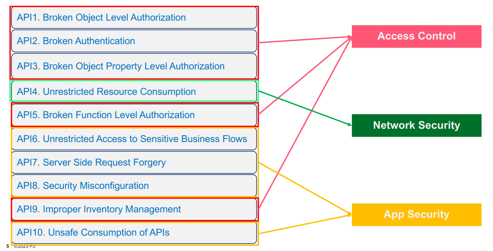

<!-- confluence-page-id: 9547514023 -->

# API Security

## Defining API Security

Designing security for a web API involves considering various factors to ensure that the API is protected against potential threats and vulnerabilities. The main factors to consider when securing an API are;

- **Authentication**: Verification of the identity of clients accessing the API. Or "Who Are you?"

- **Authorization**: Definition access controls to specify what actions can be performed within the API. Or "What are you allowed to do?"

- **Encryption**: Securing of sensitive data transmitted to prevent eavesdropping and data tampering.

- **Input Validation**: Validation and sanitation of all input data received from clients to prevent injection attacks.

- **API Versioning**: Use versioning in APIs to manage changes and updates while maintaining backward compatibility. This helps ensure that security features remain consistent across different versions of the API.

- **Rate Limiting**: Implement rate limiting to prevent abuse of the API by limiting the number of requests that can be made within a certain time period.

- **Logging and Monitoring**: Log all API activities and monitor system logs for suspicious behaviour. This enables early detection of possible security incidents and provides audit trails for forensic analysis.

- **Secure Third-Party Integrations**: If the API relies on third-party services or libraries, ensure they are reputable and regularly updated to address security vulnerabilities.

- **Security Testing**: Conduct regular security assessments, including penetration testing and vulnerability scanning, to identify and remediate security weaknesses in the API.

These factors should be considered in conjunction with the OWASP Top Ten API Vulnerabilities. The Open Worldwide Application Security Project (OWASP) is a nonprofit foundation that works to improve the security of software. It provides monitoring of security threats and gathering of metrics around threats significance. The [OWASP Top 10 API](https://owasp.org/www-project-top-ten/) Vulnerabilities are the 10 most significant threats to an API at any given time. Considering the OWASP top 10 in the context of the factors above can help the design of secure APIs and target specific areas for threats.

## OWASP 2023 Review

The OWASP Top Ten Vulnerabilities in relation to APIs are broken into three areas;

- Access Control,
- Network Security, and
- Application Security.

These can be grouped as shown below, with relevant security factors noted;

### Access Control Vulnerabilities

- **Broken Object Level Authorization**: APIs tend to expose endpoints that handle object identifiers, creating a wide attack surface of Object Level Access Control issues. Object level authorisation checks should be considered in every function that accesses a data source using an ID from the user.  _**Factor**: Authorization_

- **Broken Authentication**: Authentication mechanisms are often implemented incorrectly, allowing attackers to compromise authentication tokens or to exploit implementation flaws to assume other user’s identities temporarily or permanently. Compromising a system’s ability to identify the client/user, compromises API security overall. _**Factor**: Authentication_

- **Broken Object Property Level Authorization**: The lack of or improper authorisation validation at the object property level. This leads to information exposure or manipulation by unauthorised parties. _**Factor**: Authorization_

- **Broken Function Level Authorization**: Complex access control policies with different hierarchies, groups, and roles, and an unclear separation between administrative and regular functions, tend to lead to authorisation flaws. By exploiting these issues, attackers can gain access to other users’ resources and/or administrative functions. _**Factor**: Authorization_

- **Improper Inventory Management**: APIs tend to expose more endpoints than traditional web applications, making proper and updated documentation highly important. A proper inventory of hosts and deployed API versions also are important to mitigate issues such as deprecated API versions and exposed debug endpoints. _**Factor**: API Versioning_

### Network Security Vulnerabilities

- **Unrestricted Resource Consumption**: Satisfying API requests requires resources such as network bandwidth, CPU, memory, and storage. Other resources such as emails/SMS/phone calls or biometrics validation are made available by service providers via API integrations, and paid for per request. Successful attacks can lead to Denial of Service or an increase of operational costs. _**Factor**: Rate Limiting and Logging/Monitoring_

### Application Security Vulnerabilities

- **Unrestricted Access to Sensitive Business Flows**: APIs vulnerable to this risk expose a business flow - such as buying a ticket, or posting a comment - without compensating for how the functionality could harm the business if used excessively in an automated manner. This doesn’t necessarily come from implementation bugs. _**Factor**: Authorization and Secure Coding Practices_

- **Server Side Request Forgery**: Server-Side Request Forgery (SSRF) flaws can occur when an API is fetching a remote resource without validating the user-supplied URI. This enables an attacker to coerce the application to send a crafted request to an unexpected destination, even when protected by a firewall or a VPN. _**Factor**: Secure Coding Practices and Input Validation_

- **Security Misconfiguration**: APIs and the systems supporting them typically contain complex configurations, meant to make the APIs more customisable. Software and DevOps engineers can miss these configurations, or don’t follow security best practices when it comes to configuration, opening the door for different types of attacks. _**Factor**: Secure Coding Practices_

- **Unsafe Consumption of APIs**: Developers tend to trust data received from third-party APIs more than user input, and so tend to adopt weaker security standards. To compromise APIs, attackers go after integrated third-party services instead of trying to compromise the target API directly. _**Factor**: Secure Third-Party Integrations_

It should be noted that there may be other factors related to these vulnerabilities as often mitigation of security vulnerabilities can involve different methods involving multiple factors.

___________________________________________________

## How do we Secure APIs?

These factors have been expanded upon in the chapters below.

## Expanded Chapters on API Security

- [API Authentication](./authentication.md)
- [API Authorisation](./authorisation.md)
- [API Encryption](./encryption.md)
- [API Input Validation](./input-validation.md)
- [Versioning of APIs](./versioning.md)
- [Testing APIs for Security](./testing-for-security.md)
- [Rate Limiting](./rate-limiting.md)
- [Secure Third-Party Integrations](./secure-third-party-integrations.md)
- [Logging and Monitoring](./monitoring-security.md)

## References

- [The Latest (2023) OWASP Top 10](https://owasp.org/API-Security/editions/2023/en/0x00-header/)
- [OWASP API Security Top 10](https://owasp.org/www-project-api-security/)
- [OWASP API Security Top 10 - Entry Page](https://owasp.org/www-project-top-ten/)
- [API Security Best Practices](https://apievangelist.com/tags/security/)
- [Securing APIs](https://www.manning.com/books/securing-apis)
- [The Web API Security Cheat Sheet](https://cheatsheetseries.owasp.org/cheatsheets/REST_Security_Cheat_Sheet.html)
- [The OWASP API 2023 Top 10: An Overview](https://www.linkedin.com/learning/the-owasp-api-2023-top-10-an-overview/owasp-and-the-owasp-api-security-project?u=2105513)

## Further info or feedback

Please email us at <codex@myob.com> or contact us on Slack: [#sig-tech-codex](https://myob.slack.com/archives/C02N8ADPGUX)
