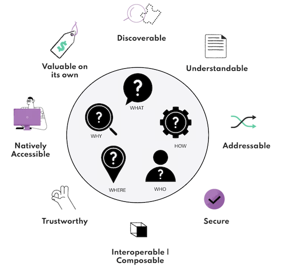

---

<!-- confluence-page-id: 10299870309 -->

# Data Product Certification?

---

Certification of the data product empowers anyone within the organisation to use it confidently and without reservation. The metrics generated by this data product are rigorously verified, monitored, and maintained on a regular basis. This process fosters a culture of Trust in Metrics across the organisation.

The certification of a data product is achieved after following the guidelines outlined on this Confluence page. Several stakeholders are involved in this certification approval process.

**Data Product Producer**: The data product producer is responsible for getting the data product certified. They need to gather the other stakeholders, follow the certification process, and make necessary amendments until all stakeholders agree to the certification.

<!-- vale Microsoft.GenderBias = NO -->
<!-- vale proselint.GenderBias = NO -->
**Data Steward**: A Data Steward is someone with domain knowledge who has a direct interest in and use of the data metrics generated from the data product. Some roles that can take up a Data Steward role are product managers, finance managers, etc.
<!-- vale proselint.GenderBias = YES -->
<!-- vale Microsoft.GenderBias = YES -->

**Date Team Member**:  Participates in a peer review process during the data product certification to ensure technical accuracy and adherence to standards.

**Governance Team Member**: Provides the approval on the certification process, ensuring all governance standards and protocols are met.

Certification ensures that the data product meets quality and integrity standards, creating trust and enabling confident decision-making across the organisation. This structured approach to data product certification involves defining quality metrics, setting up monitoring processes, performing regular data quality checks, and ensuring that all certification steps are documented and followed rigorously.

## A Framework for Data Product Certification

For the data product certification, characteristics of a data product need to be measured across several dimensions: what, why, where, how, and who.

**What**: This dimension explains the characteristic itself. For example, if the characteristic is "trustable," it refers to the quality and integrity standards that the data product needs to meet.

**Why**: This dimension explains the reason behind implementing the characteristic. Continuing with the example of "trustable," the reason for this characteristic would be to ensure confident decision-making and to reduce the cost of experimentation by maintaining consistent and reliable data quality.

**Where**: This dimension describes the tools and platforms where the characteristic can be implemented and checked. For instance, "trustable" characteristics can be verified using data quality tools and governance frameworks.

**How**: This dimension outlines the specific steps that need to be followed to implement the characteristic. For "trustable," the steps might include defining quality metrics, setting up monitoring processes, and performing regular data quality checks.

**Who**: This dimension identifies the stakeholders involved in certifying that the characteristic is properly implemented. For "trustable," these stakeholders could include data product owners, data quality analysts, and governance teams.

## Discoverable
<!-- vale Microsoft.GenderBias = NO -->
<!-- vale proselint.GenderBias = NO -->
|                |                     |
| -------------- | ------------------- |
| **What** | Can users at MYOB independently find your data product and view all the relevant metadata? Does not conflict or contradict with any other data product.|
| **Why** | <ul><li>Greater usage and value.</li><li>Reduced cost of experimentation.</li></ul> |
| **Where** | Data hub/ Glean |
| **How** | Data product easily discoverable by non-technical stakeholders. Integration with Glean can help the discoverability with different terms. |
| **Who** | Data Steward (Product Manager, Finance, CommOps, Marketing etc.) |
<!-- vale proselint.GenderBias = YES -->
<!-- vale Microsoft.GenderBias = YES -->

## Addressable
<!-- vale Microsoft.GenderBias = NO -->
<!-- vale proselint.GenderBias = NO -->
|                |                     |
| -------------- | ------------------- |
| **What** | Does it have a permanent and unique address so that the users can access it programmatically or manually without significant friction or a lengthy process? |
| **Why** | Greater usage and value. |
| **Where** | Data hub |
| **How** | Output ports are clearly defined. |
| **Who** | Data Steward (Product Manager, Finance, CommOps, Marketing etc.) |
<!-- vale proselint.GenderBias = YES -->
<!-- vale Microsoft.GenderBias = YES -->

## Understandable
<!-- vale Microsoft.GenderBias = NO -->
<!-- vale proselint.GenderBias = NO -->
|                |                     |
| -------------- | ------------------- |
| **What** | Are use cases, consumers, scope and alignment clearly defined. Is there a formal representation of semantics and schemas available for the users to understand and use the data? |
| **Why** | <ul><li> Faster decision making.</li><li>Greater usage and value.</li><li>Reduced cost of experimentation.</li></ul> |
| **Where** | Data hub |
| **How** | <ul>Use cases, consumers, scope etc are clearly defined. <li>User cases: several business cases that data product can be applied.</li><li> Consumers: stakeholders who this data product is aimed for. </li><li> Scope: (inclusions, exclusions, date ranges)</li><li> Alignment: Source-aligned or consumer aligned.</li><li> Any deviations to similar data products are explained. </li></ul>|
| **Who** | <ul><li>Peer review by other data team.</li><li> Data Steward (Product Manager, Finance, CommOps, Marketing etc.)</li></ul> |
<!-- vale proselint.GenderBias = YES -->
<!-- vale Microsoft.GenderBias = YES -->

## Trustable
<!-- vale Microsoft.GenderBias = NO -->
<!-- vale proselint.GenderBias = NO -->
|                |                     |
| -------------- | ------------------- |
| **What** | Can it be trusted with quality and integrity per the expectations so that Data products can be consistently and reliably combined together, follow standardisation and harmonisation rules using DBT tests? Are the metrics agreed upon stakeholders and data teams? |
| **Why** | <ul><li>Reduced cost of experimentation.</li><li> Confident decision making.</li></ul> |
| **Where** | DBT/Snowflake/PowerBI |
| **How** | <ul><li>Generate dbt-tests using schema generator on Glean.</li><li> Stakeholders and data teams agree on metrics.</li></ul> |
| **Who** | <ul><li>Peer review by other data team. </li><li> Data Steward (Product Manager, Finance, CommOps, Marketing etc.)</li></ul> |
<!-- vale proselint.GenderBias = YES -->
<!-- vale Microsoft.GenderBias = YES -->

## Natively Accessible
<!-- vale Microsoft.GenderBias = NO -->
<!-- vale proselint.GenderBias = NO -->
|                |                     |
| -------------- | ------------------- |
| **What** | Can data users access it with their native tools without significant friction or a lengthy process? |
| **Why** | <ul><li>Greater usage and value.</li><li> Reduced cost of experimentation.</li></ul> |
| **Where** | Snowflake/PowerBI |
| **How** | The data product can be effectively utilised by stakeholders using native tools such as Snowflake, enabling streamlined access to insights and data queries. |
| **Who** | Data Steward (Product Manager, Finance, CommOps, Marketing etc.) |
<!-- vale proselint.GenderBias = YES -->
<!-- vale Microsoft.GenderBias = YES -->

## Valuable on its own
<!-- vale Microsoft.GenderBias = NO -->
<!-- vale proselint.GenderBias = NO -->
|                |                     |
| -------------- | ------------------- |
| **What** | Does it have an output that is valuable and meaningful on its own? |
| **Why** |  Focus on value and impact. |
| **Where** | Snowflake |
| **How** | Stakeholders can independently comprehend and create metrics, empowering them to confidently analyse and interpret data within their native tools, such as Snowflake. |
| **Who** | Data Steward (Product Manager, Finance, CommOps, Marketing etc.) |
<!-- vale proselint.GenderBias = YES -->
<!-- vale Microsoft.GenderBias = YES -->

## Interoperable
|                |                     |
| -------------- | ------------------- |
| **What** | Does it clearly define standardised features to facilitate joining and interaction with other data products? E.g.: schemas, support for data linking, shared metadata structures, and stable structures that allow backwards compatibility. |
| **Why** |  <ul><li>Faster decision making.</li><li> Greater usage and value.</li></ul> |
| **Where** | DBT/Snowflake |
| **How** | Integrating DBT tests ensures that your data adheres to the required format and quality standards persistently. |
| **Who** | Peer review by other data team. |

## Secure
|                |                     |
| -------------- | ------------------- |
| **What** | Can it be securely stored and consumed? Can access be granted by data product/domain owners so that Data product teams can consume the data products from other teams with confidence and without significant friction or a lengthy process? |
| **Why** |  <ul><li>Greater usage and value.</li><li> Reduced cost of experimentation.</li><li> Faster decision making.</li></ul> |
| **Where** | Snowflake / Data Governance |
| **How** | You can implement compliant with data governance standards by ensuring PII and restricted data are tagged correctly. |
| **Who** | Governance? |
