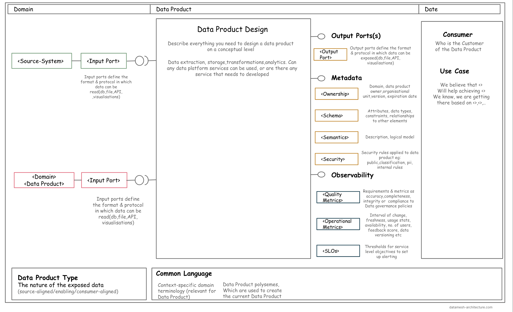

<!-- confluence-page-id: 9293955838 -->

# Designing a data product

A Data Product Canvas is a visual framework that guides your team through the data product specification. It can be used to establish a structured process of data product design across an organisation. We suggest to fill out this canvas collaboratively. In total, the Data Product Canvas consists of ten building blocks:

* Domain
* Data Product Name
* Consumer and Use case
* Output Port
* Metadata
* Input Ports
* Data Product Design
* Observability
* Common Language (Ubiquitous Language)
* Data Product Type (Classification)

You can access the Miro template: [here](https://miro.com/app/board/uXjVMqeaJMU=/?moveToWidget=3458764563535882389&cot=14)

You can also view an example canvas [here](https://miro.com/app/board/uXjVMqeaJMU=/?moveToWidget=3458764563535882390&cot=14)

## Further info or feedback
* To learn more about data canvas, read [this article](https://www.datamesh-architecture.com/data-product-canvas)
* To understand what a data product is, click [here](./data-product.md).
* To learn how to identify data products for a use case, click [here](./identifying-data-products.md).

Please email us at codex@myob.com or contact us on slack: [#sig-tech-codex](https://myob.slack.com/archives/C02N8ADPGUX)
