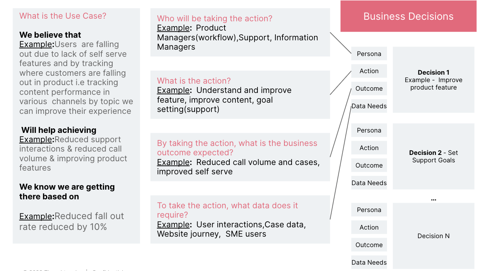
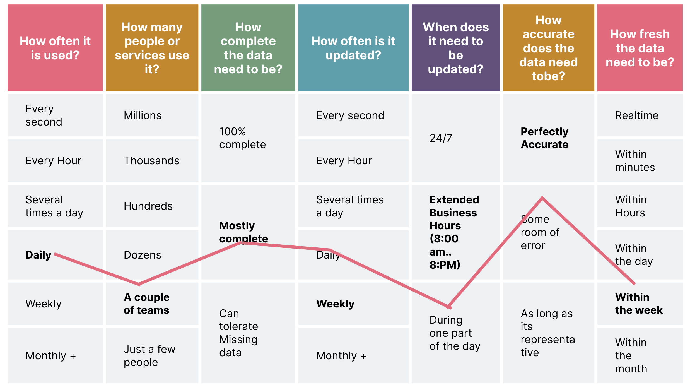
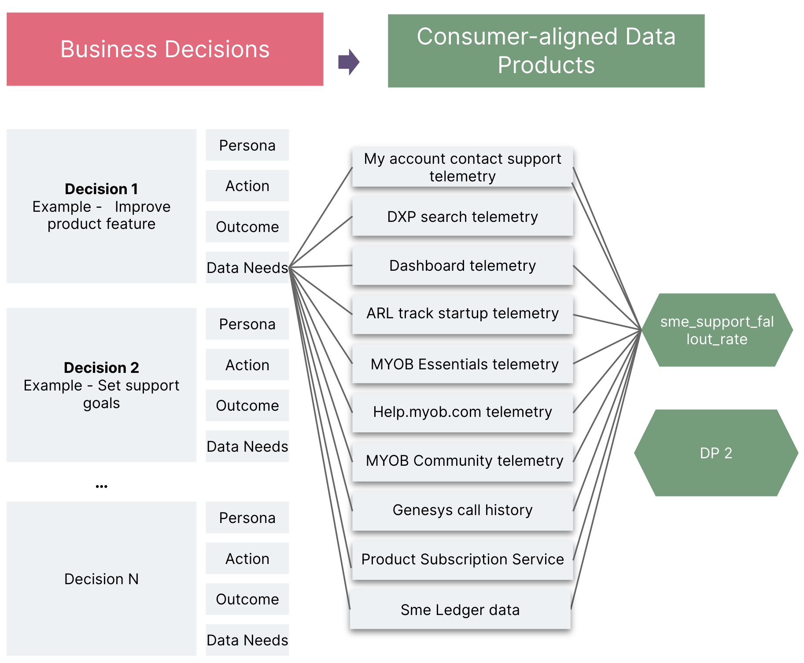
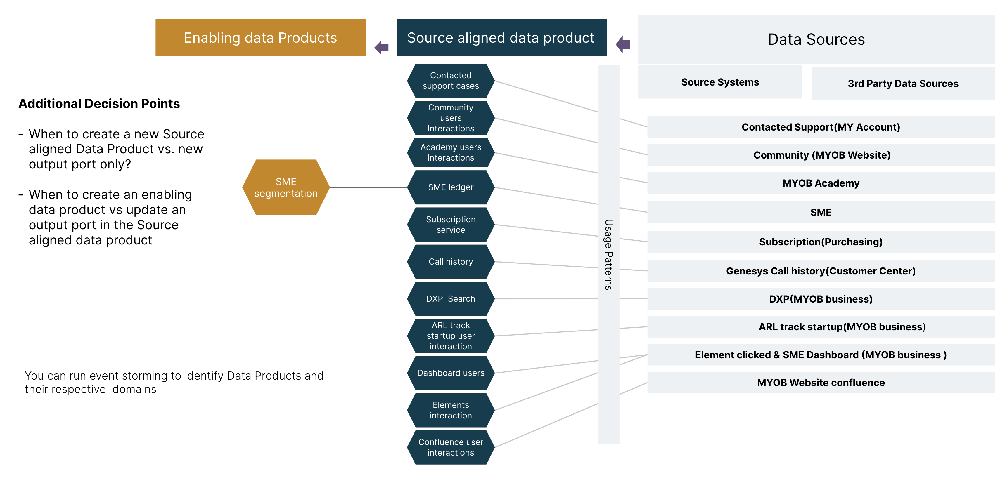
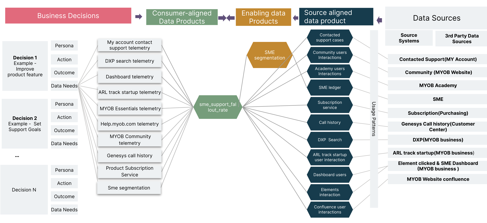

<!-- confluence-page-id: 9293923383 -->

# Identifying data products

The keys to creating valuable and reusable data products are to focus on the user and not  make them more complicated than they need to be. To avoid this anti-pattern, we recommend the following steps to identify data products for a use case:

1. List the data-driven business decisions with business context and use cases that derive data needs.

   Example of how you can list the decisions and context.
   

2. Identify the data usage pattern.

   Here is an example of how you can identify the usage pattern.
   
   This process will enable you to determine the SLO (e.g: 95% of transactions should be processed before 6:00 AM every Monday) and then further identify SLIs that need to be set for individual data products for the use case.

   For example:
   * Freshness
   * Completeness
   * Availability
   * Timeliness
   * Validity
   * Uniqueness
   * Accuracy
   * Consistency

3. Categorise data needs into [Consumer-aligned data products](./identifying-data-products.md#consumer-aligned-data-product) by understanding common data needs and usage patterns.

   Example representation of identifying consumer aligned data product:
   

4. Identify the [Source-aligned data products](./identifying-data-products.md#source-aligned-data-productsource-aligned-data-product) and [Enabling data products](./identifying-data-products.md#enabling-data-product) by understanding the usage patterns.

   Example representation:
   

5. Connect [Consumer-aligned data products](./identifying-data-products.md#consumer-aligned-data-product) with [Source-aligned data products](./identifying-data-products.md#source-aligned-data-product) and [Enabling data products](./identifying-data-products.md#enabling-data-product) with more in-depth discussions with the relevant stakeholders like domain owners, product owners etc. Note that every data product should be owned by a domain.

   Example representation:
   

**Note**: Data Product identification for a use case should follow the same process as any other [product discovery at MYOB](https://helpme.myob.com/hc/en-us/articles/4409249871897#01FN86BTJ91KCTK6CPDXAD0FJ4) i.e same people or teams who are responsible for identifying/managing new products/features would be responsible for data products.

## Types of data products

### Source-aligned Data Product

When the domains (aligned along the customer journey) publish their data as data products, so that consumers can access them to build another data product for a use case, then this domain data can be referred to as source-aligned. Most of the data in the source aligned data products correspond closely to the domain events and entities generated in their operational systems.

### Enabling Data Product

Enabling data products are data products that are derived from existing data products to provide foundation for various other data products. They are created mostly due to the need to reuse them for various use cases.

For example: A 360-degree customer view can be used by different teams in a company to build data products for a variety of purposes. The marketing team could use a customer 360 to build a data product that identifies customers who are most likely to be interested in a new product or services. The sales team could use a customer 360 to create a data product that lists customers who are using a competitor's product or who are nearing the end of their contract. The service and support team could use a customer 360 to build data products for more personalised and efficient support.

### Consumer-aligned Data Product

Many business departments need data from the whole value stream to make sensible decisions. E.g.: Management requires detailed reports and KPIs from all domains to identify strengths and deviations. Marketing would need to do funnel and web analysis over all steps in the customer journey. In these domains, the data model is optimised for a specific department's needs and thus the focus is on fulfilling data needs of one specific business domain, and can therefore be described as consumer-aligned. This data product is typically used for analytics and reports. Consumer-aligned data products are not usually created for sharing with multiple domains.

## Further info or feedback

* Check out [this article](https://www.thoughtworks.com/en-au/insights/articles/data-mesh-in-practice-product-thinking-and-development) for a example of product thinking in Data mesh.
* Read more about aligning your data mesh goals and strategy [here](https://martinfowler.com/articles/data-mesh-accelerate-workshop.html#DiscoveringDataProducts)
* Check out [this](https://www.thoughtworks.com/insights/blog/data-strategy/building-an-amazon-com-for-your-data-products) article about surfacing SLOs and SLIs.
* Refer to [data product canvas](./designing-data-product.md) to design a data product.
* To understand what a data product is, click [here](./data-product.md).

Please email us at <codex@myob.com> or contact us on slack: [#sig-tech-codex](https://myob.slack.com/archives/C02N8ADPGUX)
