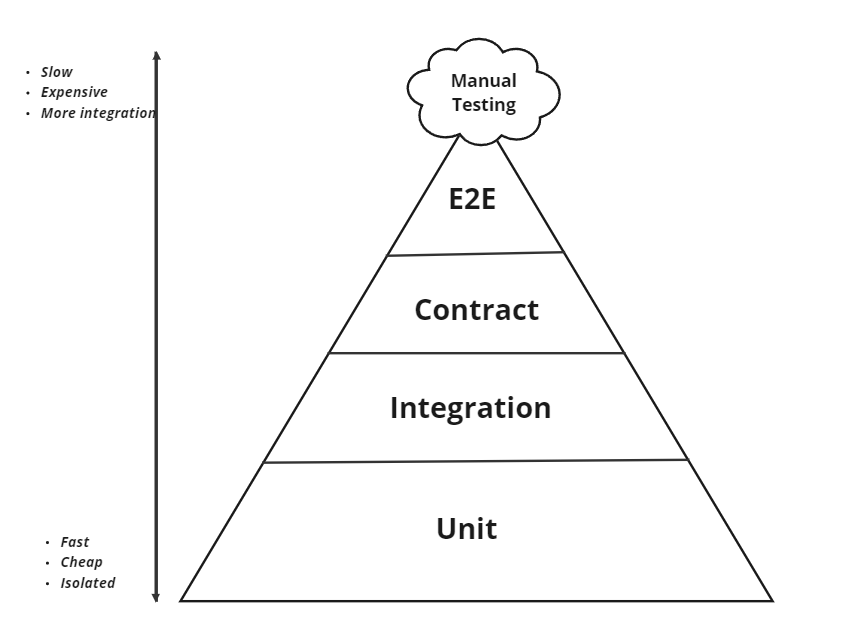
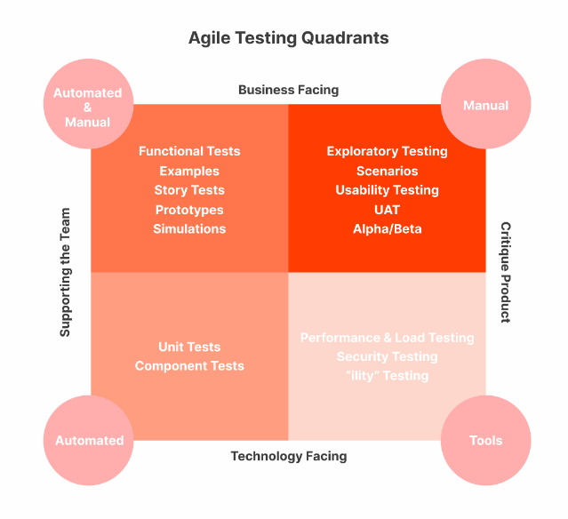

<!-- confluence-page-id: 9341740083 -->
# Testing Strategy

#### Level of guidance: Default

###### Status: In Progress

## What is it?

Testing strategy defines the roadmap and approach for how testing will be conducted to ensure that the software meets its specified requirements and quality standards.

## Why do we have it?

Testing strategy enable us to ensure that the testing process is well-planned, organised and aligned with the overall goals of the project. It helps us to deliver high quality software while minimising risks and uncertainties.

## How do we do it?

We advocate strong inclination towards automation and shift-left, as it improves efficiency and builds consistency in how we test, thereby enabling scale & regularity of testing.

Few key points to consider

- Apply correct testing types.
- Identify when to automate and when to perform manual testing.
- Follow testing pyramid by identifying correct testing levels.

### Functional testing

Ensure that the software performs its intended functions correctly and meets the business requirements.

#### Testing Pyramid

The testing pyramid is a conceptual model that represents the distribution of different types of tests. The idea is to have a strong foundation of unit tests followed by fewer number of integration or end-to-end tests. This structure is based on the principle that lower-level tests are faster to execute, easier to maintain, and provide granular feedback during development. As you move up the pyramid, tests become slower, more complex, and may be more brittle. While we are encouraging teams to do test automation as much as possible, we also encourage them to follow the testing pyramid when automating, to deliver a quality product to our customers.
_More details can be found in [this article](https://martinfowler.com/articles/practical-test-pyramid.html) by Martin Fowler_

However, when following the testing pyramid, some may still have trouble identifying which testing type they should be applying when automating tests. Testing quadrants helps you to understand when and how to apply these techniques.

_Image reference and more details can be found in [this article](https://testsigma.com/blog/agile-testing-quadrants/)_

#### Automated testing

##### Unit tests

The purpose is to validate that each unit or component of the software code performs as expected. Unit Testing is done during the development. A unit can be scoped differently depending on how you are applying it. e.g You can define a unit of behaviour with a [BDD](https://en.wikipedia.org/wiki/behaviour-driven_development) style given, when, then or you could be testing a 'code' unit such as a function, procedure, module etc.
Unit tests are fast and cheap to run. This means as much of these types are encouraged.

When writing unit tests, consider the layer that you are going to unit test. Following are a few examples from our existing platforms

- Unit test types for UI – Component, Reducer, Selector, Module, Actions
- Unit test types for back-end services/ APIs– Transformer, Services, Adaptor, Router, Controller, Middleware

##### Integration tests

Software modules are integrated logically and tested as a group. The purpose of this level of testing is to make sure the interaction between these software modules is performing as expected.
Integration tests can be written in several ways including (but not limited to):

- System integration
  - Mocked
  - As is (Direct integration)
- Service to a database
- Method to a database
- Method to a method
- Between 2 units
- SubC Tests (subcutaneous test mean a test that operates just under the UI of an application. This is particularly valuable when testing the application's end-to-end behaviour excluding the UI component.)

##### Contracts tests

Focuses on ensuring that the interactions between different components or services adhere to a specified contract. This contract defines the expected behaviour, data formats, and communication protocol between these components or services.

##### End to End

Verify the end-to-end user workflows. It is recommended to automate E2E processes if not already covered at a lower level, as maintaining E2E automated tests can be highly time-consuming.

##### Regression

Regression testing is performed to ensure that recent code changes do not negatively impact the existing functionality of a software application. The primary goal of regression testing is to verify that new code modifications, such as bug fixes, enhancements, or new features, have not introduced unintended side effects or caused existing features to break. Ideally regression tests must be automated. If you have any difficulties on automating, make sure that you maintain a manual regression suite. You can use any test management tool (JIRA , TestRail)

##### Smoke tests

Verify that the most critical functionalities of the software work as expected after a new build or version is deployed. Recommend automating the smoke test and run it after any deployment to test environment or production environment.

#### Manual testing

In MYOB we advocate shift-left approach to identify and resolve issues much earlier in the development cycle, and automation of tests to reduce manual testing reliance. However, we acknowledge the need for manual testing on some occasions. We encourage you to keep manual testing limited to sanity or exploratory testing.

##### Sanity

This testing is manual to ensure that specific functionalities and components work as intended after any changes or modifications.

##### Exploratory tests

Emphasises the creativity and freedom of the tester to explore the software application without predefined test cases. Instead of following a scripted test plan, the tester dynamically designs and executes test cases based on their knowledge, experience, and intuition. The primary goal of exploratory testing is to uncover defects, gaps, and potential issues in the software through active and dynamic exploration. This is a manual testing type

### Non-functional testing

Ensure that the end user get positive user experience.

#### Performance

Performance test assesses how well a system performs under specific conditions. It aims to identify and remove bottlenecks, ensure stability, and optimise the overall efficiency of an application or system.

We encourage you to bring the performance conversations early in the application development process. Make sure to set SLIs/ SLOs and deliver high quality software that performs well for end users

- Web site/ New API end point
- Make sure to test end point response is meeting agreed SLIs and SLOs.
- Make sure to test with small/ medium/ large test data. Specify thresholds for the functionality that determine if a dataset is small, medium or large.
- New application
- Make sure the system is resilient, reliable and scalable under different conditions.

##### Types of performance testing

This section explains different types of performance tests to consider when creating a performance test plan.

- Performance : an umbrella term including any kind of testing focused on performance (responsiveness) of the system or component under different volumes of
load.
- Load : focuses on the ability of a system to handle increasing levels of anticipated realistic loads resulting from transaction requests generated by controlled numbers of concurrent users or processes.
- Stress : focuses on the ability of a system or component to handle peak loads that are at or beyond the limits of its anticipated or specified workloads.
- Scalability : focuses on the ability of a system to meet future efficiency requirements which may be beyond those currently required.
- Spike : focuses on the ability of a system to respond correctly to sudden bursts of peak loads and return afterwards to a steady state.
- Endurance : focuses on the stability of the system over a window of time specific to the system’s operational context.
- Concurrency : focuses on the impact of situations where specific actions occur simultaneously (e.g., when large numbers of users log in at the same time).
- Capacity : determines how many users and/or transactions a given system will support and still meet the stated performance objectives.

_Reference [ISTQB](https://www.anztb.org/) performance testing syllabus_

#### Security

Performed to identify potential security vulnerabilities. At MYOB we use various tools and techniques to do this which can be found in the [Security chapter](../security/README.md).

### Practices

##### Bug bash

An informal and collaborative event in software development where a group of individuals, including developers, testers, designers, and other stakeholders, come together to find and address bugs or issues in a software application. The primary goal of a bug bash is to identify and resolve as many issues as possible within a defined period. This is purely a manual testing task. Bug bash can be performed when the application under development completes good amount of features, integrate with other systems, before a major release.

- Example Templates:
  - [Template 1](https://myobconfluence.atlassian.net/wiki/spaces/SA/pages/8746442165/Bug+Bash+Template)
  - [Template 2](https://myobconfluence.atlassian.net/wiki/spaces/PAY/pages/9096658945/Template+-+Bug+Bash+-+Feature)

#### Observability

Please refer to [observability section in engineering](../engineering-standards/engineering.md)

#### Synthetic tests

Synthetic testing is a practice that use to proactively identify issues or potential failures before they impact real users. Synthetic testing can apply to various types of testing including functional, performance, availability, and security.

## References and examples

- [ADR MYOBB](https://myobconfluence.atlassian.net/wiki/spaces/MBiz/pages/9305292801/ADR+-+Quality+Assurance+Framework+Implementation)
- [ADR AccountRight](https://myobconfluence.atlassian.net/wiki/spaces/ARDevelopment/pages/9305622761/ADR+-+Quality+Assurance+Framework+Implementation)
- Performance testing tools [Tech Radar](https://tech-radar.myob.com/)

## Further info or feedback

Please email us at <codex@myob.com> or contact us on slack: [#sig-tech-codex](https://myob.slack.com/archives/C02N8ADPGUX)
