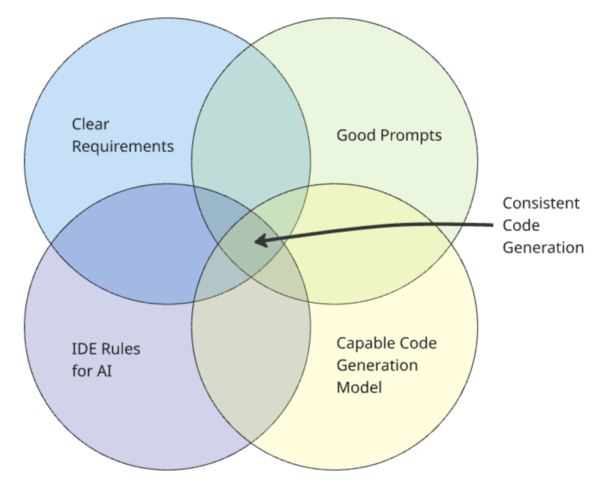

---

# The Four Pillars

---

To generate consistent code, four elements must come together as shown in this diagram:

*Image: Venn diagram showing the intersection of elements for consistent AI code generation*

## The Four Elements

### 1. Clear Requirements

**Purpose:** Define the functional and technical requirements for the product or service idea you want to implement. Be detailed and clear.

**Where to create:** Use an advanced "thinking" chat model like Claude or ChatGPT.

**Reference:** [Generating Requirements Workflow](../generating-requirements/README.md)

### 2. Good Prompts

**Purpose:** Create clear, detailed requests for specific tasks. You can refer to the IDE rules and the requirements. However, you don't need to repeat what's in the rules or requirements in the prompt.

**Where to create:** Create prompts manually at first but then refine them using a chat model like Claude or ChatGPT.

**Reference:** Prompt engineering and meta prompting is explained further in the [Prompting Guidance](../appendix/prompt-library/prompting-guidance.md)

### 3. Rules for AI

**Purpose:** AI Rules define consistent and repeatable standards, patterns and conventions across your codebase.

**Where to create:** Rule file formats are usually defined by the AI IDE tool. To help generate the rules themselves, use a chat model like Claude or ChatGPT.

**Reference:** [Rules for AI](../appendix/rules-for-ai)

### 4. Capable Code Generation Model

**Purpose:** Use the most capable LLM model for the task you are running to get good quality results. Not all tasks need advanced thinking models, so select the most cost-effective model that can achieve the outcome you want. Consider thinking models for planning tasks and general models for lower level tasks. 

**Where to create:** The AI IDE tools typically let you select which model to use when prompting the LLM.

## How the Pillars Work Together

When all four pillars are properly aligned:

- **Clear Requirements** provide the "what" - defining exactly what needs to be built
- **Good Prompts** provide the "how" - instructing the AI on the specific implementation approach
- **Rules for AI** provide the "standards" - ensuring consistent code quality and patterns
- **Capable Models** provide the "execution" - generating high-quality code that meets requirements

## Implementation Tips

- **Start with Requirements** - Never begin coding without clear, detailed requirements
- **Iterate on Prompts** - Refine your prompts based on the quality of generated code
- **Maintain Rules** - Keep your AI rules updated as your codebase evolves
- **Choose Models Wisely** - Use advanced models for complex tasks, efficient models for simple ones

## Next Steps

Read and understand the detailed [Prompting Guidance](../appendix/prompt-library/prompting-guidance.md) before you start implementing.

---

**Previous:** [← Workflow](workflow.md) | **Next:** [Mindset →](ai-working-mindset.md)

---
