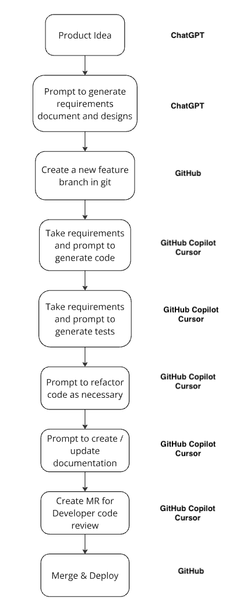

# Workflow

The diagram below shows the main steps in this playbook. We've deliberately simplified it. This development workflow follows recognised best practices already used throughout MYOB, with help from AI tools and techniques.

*Image: Simplified development workflow diagram*

### Key stages of the workflow

- **Product or service idea** - This represents the problems you need to solve for your users using existing service design and user research techniques
- **Prompt to generate requirements documents and designs** - Use advanced models, such as the latest "thinking" models, to generate requirements documentation (features, user stories, data models) from your clearly defined ideas
- **Create a new feature branch in git** - This workflow uses traditional git branching strategies for code versioning. Git is a simple proven technique that helps you manage AI generated changes
- **Take requirements and prompt to generate code** - Use the requirements from the previous step to prompt the Artificial Intelligence Coding Assistants (AICAs) to generate code
- **Take requirements and prompt to generate tests** - Generate tests from the same product requirements in the Coding Assistant. This makes sure the business logic defined in the requirements are tested independently from the code generation
- **Prompt to refactor as necessary** - You can also prompt additional refactoring of the code at this point
- **Prompt to create or update documentation** - Keep documentation up to date by prompting the Coding Assistant to update documentation based on the changes you've made
- **Create PR for developer code review** - Generate a Pull Request (PR) in git following traditional development practices. Review each line of code for quality and brevity, making sure that the code to be deployed is production-ready
- **Merge and deploy** - Once you merge the PR into the main branch, use automated pipeline processes to deploy the code, as per your normal deployment processes

## Benefits of This Workflow

- **Consistency** - Standardized approach across all MYOB development teams
- **Quality** - Built-in testing and review processes ensure high-quality outputs
- **Efficiency** - AI assistance accelerates development while maintaining standards
- **Traceability** - Clear documentation and version control for all changes
- **Collaboration** - Traditional PR process enables team collaboration and knowledge sharing

## Best Practices

- **Start Small** - Begin with simple features to understand the workflow
- **Review Everything** - Never deploy AI-generated code without human review
- **Document Decisions** - Keep clear records of requirements and design decisions
- **Test Thoroughly** - Use both AI-generated and manual tests for comprehensive coverage
- **Iterate Quickly** - Use short feedback loops to refine and improve

---

**Previous:** [← Getting Started](README.md) | **Next:** [The Four Pillars →](the-four-pillars.md)
