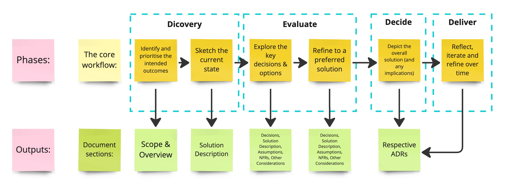

<!-- confluence-page-id: 9346258106 -->

# Solution Design Process

 At a high level, solution design goes through several phases. The way you execute those phases depends on the scale of the problem and impact. Clear guidelines on identifying scale of scope are called out in the [Decision Framework](../decision-framework.md). Identifying the right scale of scope will highlight the stakeholders that need to be involved, the effort that goes into the steps, and how it is documented.

## Phases

The recommendation is that we do not skip any of the following phases and ensure we adjust effort based on the context & complexity of the problem. Additionally, we don’t want to re-document, rather reference/ link what already exists.

- **Phase 1**: Identify and prioritise the intended outcomes
- **Phase 2**: Sketch the current state
- **Phase 3**: Explore the key decisions & options
- **Phase 4**: Refine to a preferred solution
- **Phase 5**: Depict the overall solution (and any implications)
- **Phase 6**: Reflect, iterate and refine over time

### Phase 1: Identify and prioritise intended outcomes

This phase will look investigate the following questions:

- What are you trying to achieve?
- Why are they important & their priorities?
- How will we know design is fit for purpose?
- List of Assessment criteria and weights
- Business and tech outcomes
- What are our constraints?
- "Peripheral" and secondary nice-to-have outcomes

#### Output (Document section): Scope & Overview

### Phase 2: Sketch the current state

As part of Phase 2, the solution design will help us understand:

- Briefly explain what we have (handy to use single diagram with colour code for additions/ changes/ deletions)
- Forces that have an impact on this problem & solution
- Existing plans, strategies, roadmaps, LOTH (both teams and organisation wide)
- What are some positive and negative impacts
- How well is this solution meeting our intended outcomes?
- Quantitative measurements where applicable

#### Output (Document section): Solution Description

### Phase 3: Explore the key decisions & options

The next phase involves:

- Discover unknowns
- Seek ideas and feedback from other stakeholders
- Include obvious and non-obvious factors
- Simple rating against the assessment criteria
- Identify risks and unknowns
- At least have 2 options (to avoid bias)

#### Output (Document section): Decisions, Solution Description, Assumptions, NFRs, Other Considerations

### Phase 4: Refine to a preferred solution

Once the options have been identified, it is important to refine the preferred options further. This can be done by:

- Pick your top 1-2 options and dive a bit deeper
- Select the preference collaboratively with the team
- Answer any significant or blocking unknowns and concerns
- Build a 'proposal'

It is imperative that this is carried out in bigger, complex solutions where deeper analysis on all options may not be possible.

Building a proposal does not mean that the team has decided. It is purely a proposal.

#### Output (Document section): Decisions, Solution Description, Assumptions, NFRs, Other Considerations

### Phase 5: Decide and document decisions

Once there is enough feedback to guide the overall solution, the team can put together the Solution Design paper and publish & take feedback via the RFC process. This can then enable the team to start their implementation.

#### Output (Document section): Respective ADRs

### Phase 6: Reflect, iterate and refine over time

Throughout implementation, teams should continue to evaluate:

- How have the priorities and our context changed now?
- Update with any changes that are raised throughout delivery (for example: during Inception)
- Ensure that there is a post implementation review to reflect & learn

#### Output (Document section): ADR

## Further info or feedback

Please email us at <codex@myob.com> or contact us on slack: [#sig-tech-codex](https://myob.slack.com/archives/C02N8ADPGUX)
